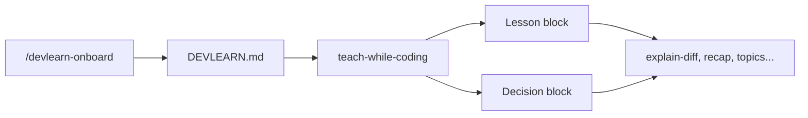
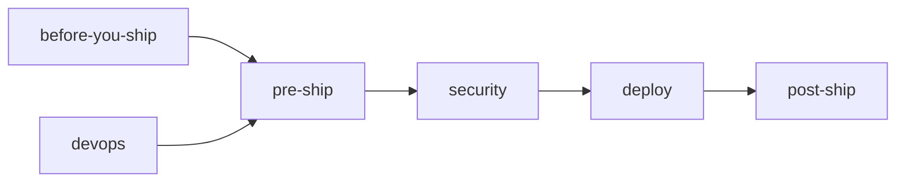

# DevLearn

**Have your coding agents teach you how to code while they work. Learn while you vibe.**

DevLearn is a curriculum of **fat agent skills** for **Cursor, Claude Code, Codex, OpenCode**, and other Agent Skills–compatible tools. They explain **what**, **why**, and **how** as the agent builds, fixes, ships, and connects your project — tuned for **vibe coders** and **seasoned developers** alike.

**Multi-agent install:** `./install.sh --agent all` (or `codex`, `opencode`, `claude`, `auto`). See [shared/agent-compatibility.md](shared/agent-compatibility.md).

## What's new in v2

- **Personas** — `viber` (feel-first lessons) vs `seasoned` (decision / alternatives / risk, quiet by default)
- **One-command install** — `scripts/install.sh` links skills **and** `shared/`
- **`/devlearn-onboard`** — 60-second setup writes `DEVLEARN.md` + `.devlearn/`
- **Session memory** — `.devlearn/progress.md`, `.devlearn/decisions.md` (ADR-lite)
- **Stack-aware routing** — React / Next detected from `package.json`
- **New skills** — recap, before-you-ship, lesson-review, debugging, react, next
- **Ship lifecycle** — pre-ship, security, devops, post-ship (+ [ship-lifecycle.md](shared/ship-lifecycle.md))
- **Example project** — [examples/todo-app/](examples/todo-app/) with stepped snapshots + [LESSONS.md](examples/todo-app/LESSONS.md)

## How it works



1. **Install** — `./scripts/install.sh`
2. **Onboard** — `/devlearn-onboard` or copy [`DEVLEARN.md`](DEVLEARN.md)
3. **Ambient** — lesson or decision blocks after substantive edits
4. **Explicit** — `/devlearn-explain-diff`, `/devlearn-recap`, topic skills, lifecycle skills, etc.

## Ship lifecycle



| Stage | Skill | When |
|-------|-------|------|
| Plan before coding | `/devlearn-before-you-ship` | Large refactor planned |
| Pre-release checklist | `/devlearn-pre-ship` | PR ready, before merge/deploy |
| Security pass | `/devlearn-security` | Auth, secrets, user input |
| CI/CD | `/devlearn-devops` | GitHub Actions, Docker |
| Go live | `/devlearn-deploy` | Public URL |
| Verify prod | `/devlearn-post-ship` | After deploy |

Details: [shared/ship-lifecycle.md](shared/ship-lifecycle.md)

**Copy-paste release day:**

```
/devlearn-pre-ship → /devlearn-security → /devlearn-deploy → /devlearn-post-ship
```

## Quick start

### One command (recommended)

From a clone:

```bash
git clone https://github.com/mrdulasolutions/DevLearn.git
cd DevLearn
./install.sh
```

The installer walks you through:

- **Where to install** — Cursor, Claude Code, Codex (`~/.agents/skills`), OpenCode, all, or auto-detect
- **Optional project setup** — `DEVLEARN.md`, Cursor rule, Codex `AGENTS.md`, repo-local `.agents/skills`
- **Verification** — checks skills + `shared/` + frontmatter spec

Non-interactive examples:

```bash
# All common agent paths
curl -fsSL https://raw.githubusercontent.com/mrdulasolutions/DevLearn/main/install.sh | bash -s -- --no-prompt --agent all --verify

# Codex / Agent Skills spec only
./install.sh --no-prompt --agent codex --verify

# Team project (Codex + Cursor)
./install.sh --project ~/code/my-app --copy-rule --copy-agents --project-skills --verify
```

No local clone? The curl command **clones DevLearn to `~/DevLearn`** and symlinks skills automatically.

### Install flags

| Flag | Purpose |
|------|---------|
| `--agent TARGET` | `cursor`, `claude`, `codex`, `opencode`, `agents`, `all`, `auto`, `both`, `custom` |
| `--project ~/code/my-app` | Copy `DEVLEARN.md` into a project |
| `--copy-rule` | Cursor rule → `.cursor/rules/devlearn.mdc` |
| `--copy-agents` | Codex `AGENTS.md` from template |
| `--project-skills` | Link skills → `project/.agents/skills` |
| `--verify` | Post-install + spec validation |
| `--no-prompt` | Non-interactive |
| `--dry-run` | Show plan only |
| `--help` | Full usage |

Platform details: [shared/agent-compatibility.md](shared/agent-compatibility.md)

### Manual install (advanced)

```bash
./install.sh --agent cursor --verify
# or legacy path:
./scripts/install.sh --no-prompt --agent claude
```

## Personas & depth

| Persona | You are | Agent emits |
|---------|---------|-------------|
| **viber** | New / vibe coding | What / Why / How + term |
| **seasoned** | Experienced dev | Decision / Alternatives / Risk (whitelist only) |
| **autodetect** | Either | Inferred from how you talk |

| Depth | Effect |
|-------|--------|
| **vibe** | Short; ship first |
| **curious** | + try-it-yourself + tradeoff |
| **deep** | + multi-file flow + skill links |

Configure in `DEVLEARN.md`:

```yaml
persona: autodetect
depth: curious
seasoned_lessons_on: [architecture, security, breaking, deps, perf]
```

Say anytime: **"just ship"**, **"more detail"**, **"explain like PR review"**.

## Skill index

| Skill | Invoke when |
|-------|-------------|
| [devlearn-onboard](devlearn-onboard/) | First-time setup |
| [devlearn-teach-while-coding](devlearn-teach-while-coding/) | Ambient teaching (DEVLEARN.md) |
| [devlearn-recap](devlearn-recap/) | "What did I learn?" |
| [devlearn-before-you-ship](devlearn-before-you-ship/) | Plan before big multi-file **code** changes |
| [devlearn-lesson-review](devlearn-lesson-review/) | Last explanation too long/basic |
| [devlearn-explain-diff](devlearn-explain-diff/) | Walk through git diff |
| [devlearn-glossary](devlearn-glossary/) | Session vocabulary |
| [devlearn-curriculum-router](devlearn-curriculum-router/) | What to learn next |
| [devlearn-debugging](devlearn-debugging/) | Errors & stack traces |
| [devlearn-git](devlearn-git/) | Commits, branches, PRs |
| [devlearn-html-css](devlearn-html-css/) | Pages & layout |
| [devlearn-javascript](devlearn-javascript/) | DOM, events, state |
| [devlearn-react](devlearn-react/) | Components & hooks |
| [devlearn-next](devlearn-next/) | App Router, server/client |
| [devlearn-apis](devlearn-apis/) | REST, env, CORS |
| [devlearn-deploy](devlearn-deploy/) | Go live |
| [devlearn-pre-ship](devlearn-pre-ship/) | Release checklist before merge/deploy |
| [devlearn-security](devlearn-security/) | Secrets, auth, OWASP-lite |
| [devlearn-devops](devlearn-devops/) | CI/CD, Docker, pipelines |
| [devlearn-post-ship](devlearn-post-ship/) | Smoke tests, monitoring, rollback |

## Sample path: todo app → live

Full walkthrough: [examples/todo-app/](examples/todo-app/)

| Step | Ask | Skills |
|------|-----|--------|
| 1–2 | "Build todo page + style it" | html-css |
| 3 | "Add and delete todos" | javascript |
| 4 | "Save across refresh" | apis |
| 5 | "Commit and explain git" | git, explain-diff |
| 6 | "Deploy shareable URL" | deploy → post-ship |
| 7 | "Add CI + pre-ship before next release" | devops, pre-ship, security |
| Wrap | `/devlearn-recap` | recap, router |

Example lesson blocks: [examples/todo-app/LESSONS.md](examples/todo-app/LESSONS.md).

## Project artifacts

| File | When |
|------|------|
| `DEVLEARN.md` | Config (persona, depth, stack) |
| `DEVLEARN_GLOSSARY.md` | Terms (`glossary: true`) |
| `.devlearn/progress.md` | Session memory (`progress: true`) |
| `.devlearn/decisions.md` | ADR-lite (`decisions: true`, seasoned) |
| `.devlearn/pre-ship-checklist.md` | Release checklist (pre-ship skill) |
| `.devlearn/post-ship-log.md` | Post-deploy verification log |

Templates: [.devlearn/](.devlearn/)

## Shared docs

| File | Purpose |
|------|---------|
| [shared/voice.md](shared/voice.md) | Teaching tone |
| [shared/lesson-block.md](shared/lesson-block.md) | Viber template |
| [shared/decision-block.md](shared/decision-block.md) | Seasoned template |
| [shared/lesson-rubric.md](shared/lesson-rubric.md) | Quality checklist |
| [shared/depth-levels.md](shared/depth-levels.md) | Persona × depth |
| [shared/session-recap.md](shared/session-recap.md) | Recap format |
| [shared/completion-protocol.md](shared/completion-protocol.md) | Status footers |
| [shared/ship-lifecycle.md](shared/ship-lifecycle.md) | Pre → ship → post flow |

## Contributing

Add a skill: `devlearn-<name>/SKILL.md` following [shared/skill-skeleton.md](shared/skill-skeleton.md). Register in this README and [curriculum-map.md](devlearn-curriculum-router/curriculum-map.md). Keep shared voice in `shared/`.

## License

MIT — [LICENSE](LICENSE)
