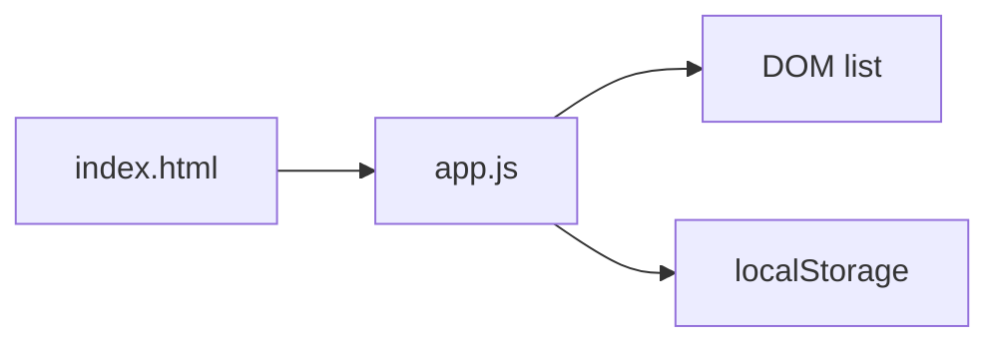

# Todo app learning example

Walk through DevLearn by building this todo app step by step. Copy `DEVLEARN.md` into this folder and enable teaching.

## Quick start

```bash
cp ../../DEVLEARN.md .
mkdir -p .devlearn
cp ../../.devlearn/progress-template.md .devlearn/progress.md
# Optional: ../../scripts/install.sh from DevLearn repo root
```

Open each step folder, copy files into this directory (or compare with `git diff`), and ask your agent to explain using `/devlearn-explain-diff`.

## Steps

| Step | Folder | Skills | You build |
|------|--------|--------|-----------|
| 1 | [step-1-html](step-1-html/) | html-css | Static page shell |
| 2 | [step-2-css](step-2-css/) | html-css | Styled layout |
| 3 | [step-3-javascript](step-3-javascript/) | javascript | Add/delete todos |
| 4 | [step-4-persist](step-4-persist/) | apis | localStorage save |
| 5 | [step-5-git](step-5-git/) | git | Commit story (init repo here) |
| 6 | [step-6-deploy](step-6-deploy/) | deploy | Deploy notes |
| 7 | [step-7-lifecycle](step-7-lifecycle/) | pre-ship, security, devops, post-ship | Release pipeline |

Example lesson blocks: [LESSONS.md](LESSONS.md).

## Release day chain

```
/devlearn-pre-ship → /devlearn-security → /devlearn-deploy → /devlearn-post-ship
```

Add CI first with `/devlearn-devops`.

## Architecture (final)



## Dogfood checklist

- [ ] Ambient lesson after step 3 edit
- [ ] `/devlearn-explain-diff` between steps
- [ ] `/devlearn-glossary` after step 4
- [ ] `/devlearn-recap` at end
- [ ] Toggle persona seasoned — verify quiet on CSS tweaks
