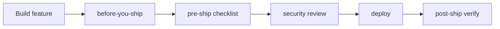

# DevLearn ship lifecycle

End-to-end flow for going from "works on my machine" to "running safely in prod" and staying healthy after.



| Phase | Skill | When |
|-------|-------|------|
| **Before coding** | devlearn-before-you-ship | >5 files, architecture change |
| **Before merge/release** | devlearn-pre-ship | PR ready, about to deploy |
| **Security pass** | devlearn-security | Auth, secrets, user input, deps |
| **Go live** | devlearn-deploy | Host, build, env on server |
| **After live** | devlearn-post-ship | Smoke test, monitor, rollback |
| **Pipeline** | devlearn-devops | CI/CD, Docker, automated gates |

## DEVLEARN.md hooks

```yaml
lifecycle:
  pre_ship_checklist: true   # suggest devlearn-pre-ship before deploy
  security_pass: true        # suggest devlearn-security on auth/secrets/input
  post_ship_verify: true     # suggest devlearn-post-ship after deploy URL exists
```

## Persona notes

| Persona | Lifecycle teaching |
|---------|-------------------|
| viber | One checklist item + one term per phase |
| seasoned | Risk, verify commands, rollback path |
| autodetect | Match user language |

## Chain prompts (copy-paste)

**Pre-release:** `/devlearn-pre-ship` then `/devlearn-security` before merge.

**Release day:** `/devlearn-deploy` then `/devlearn-post-ship` on the live URL.

**Pipeline:** `/devlearn-devops` when adding GitHub Actions or Docker.
